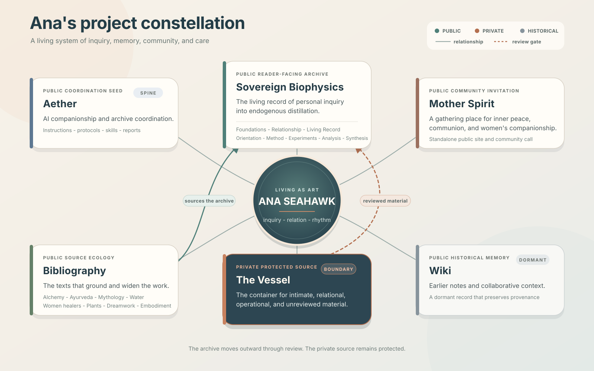

# 94. Project Constellation

**Date:** 2026-08-25

**Agent:** Codex / GPT-5

**Session topic:** A public-safe visual map of Ana Seahawk's active project ecology

---

The work forms one living system. Aether holds coordination and memory.
Sovereign Biophysics carries the public research archive. The Vessel protects
the intimate and unreviewed source. The Bibliography grounds the inquiry,
Mother Spirit opens toward community, and the Wiki preserves earlier context.

The map names visibility boundaries directly. Material moves from The Vessel
only through review; the protected source remains private.

**Sources:** `README.md`, `soul.md`, `Components/website/README.md`,
`protocols/active-surfaces.md`, public submodule metadata, and public project
structure inspected on 2026-08-25. No private body content was used.
